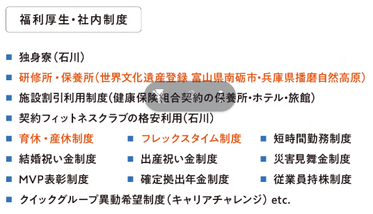
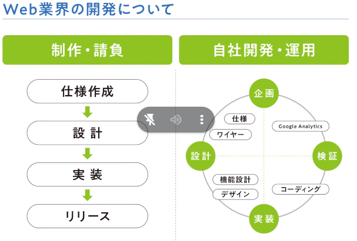
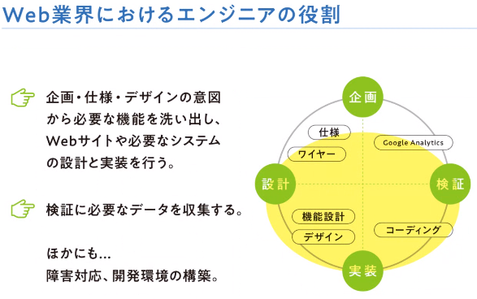
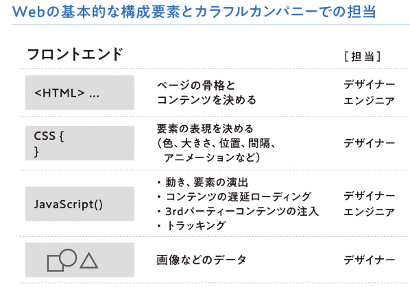
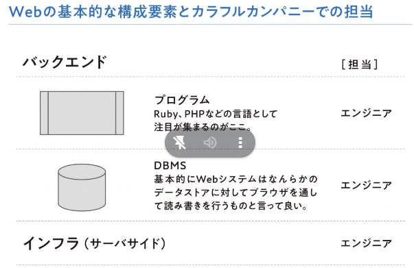

# 25卒のオンラインインターン用のリポジトリ
## Ruby on RailsでAPIサーバを作る
### 自己紹介
中田1：学院大（法学系）
中田海斗：PHPのLarabelを使って開発とかしている

## 会社/事業紹介
### 会社
1983年の4月ある会社、北陸に拠点がある。親会社に東証プライム上場をしているクイック社がある。
経営理念として「かかわった人全てをハッピーに」
事業理念「人材」・「情報」ビジネスを通じて

ミッション：地元の暮らしをカラフルに
「人材」「情報」を軸に地域の課題解決を目指す集団
- 幅広い事業概要
コンサルティング・ポスティング・コンシェルジュの3つ
#### コンサル
フリーペーパーや雑誌を展開している（週一発行）
金沢情報とかはここ
代理店サービスとしてリクルート求人メディアもやってる
イベント・委託事業
Web商品：自社メディア運営
クライアントのWeb集客サポート
Webサイトを作ったり、Web広告、SNS運用、動画制作、サイト分析など
例）食品メーカーの単品商品の売り上げ向上のために、フォトコンテストを実施し、
Webページへの誘導とInstagram広告を貼った。
例）地元の求職者と企業を繋げる
ホテルの客室清掃スタッフ募集
主婦の採用を多くしたいというニーズにたいして、主婦層に興味をもってもらうため、第三者視点での情報の掲載の仕方をしたことによって増やした

#### ポスティング
チラシ・DMなどの一般家庭へのポスティング

#### コンシェルジュ
ココカラという転職・縁結び・家づくりナビなどのサービスを行っている
Web開発側はここのサイト開発も行っている
例）人材紹介コンサル
採用支援と転職支援で地元の企業やお店に就職する人材とマッチングさせる
薬剤師採用の際に、「ココカラ転職」のスカウトを駆使してマッチングさせた。

#### 労働環境
新入社員研修：名刺交換から基礎的なマナー研修、クイックグループ全体の企業理解を深める（Web側で就職すると、エンジニア採用なら独自の研修を受けることになる）
スキルアップ研修：年に数回、外部講師を招いて研修を行っている

「よく働き、よく遊べ」
年間休日129日、夏休み10連休、GW6連休、冬休み7連休

「若手にも活躍のチャンスを」

#### Web開発業界
おおよそ「制作・請負」「自社開発・運用」に分けられる

##### フロントエンド

##### バックエンド

ここはよくGCP(Google Cloud Platform)を使っている

